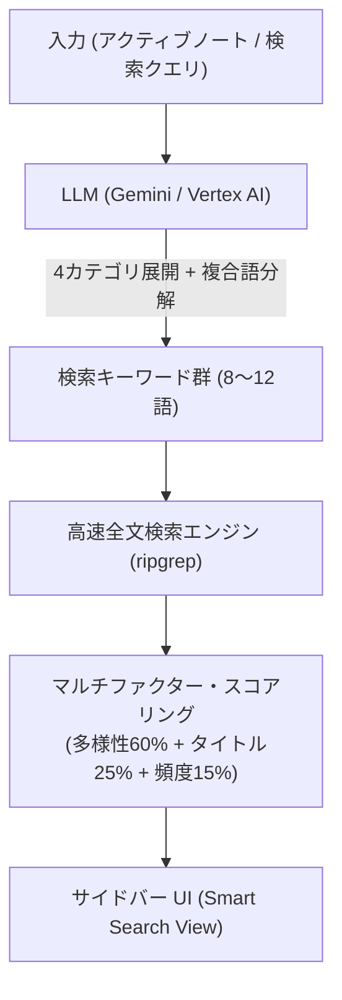

# 🔍 Smart Search for Obsidian

> **AI Query Expansion + High-Speed `ripgrep` Search**  
> 自然言語クエリや開いているノートから、LLMが「本質的なキーワード」を多角的に展開し、ローカルVaultを爆速全文検索して最適なノートを発見するObsidianプラグイン。

---

## ✨ 特徴 (Key Features)

1. **🧠 AI クエリ拡張（Query Expansion / Query Rewriting）**
   - ユーザーの曖昧な質問や検索キーワードから、LLM（Gemini）が「固有名詞」「ビジネス課題」「技術用語」「同義語・表記揺れ」の4視点で8〜12個のキーワードを自動生成。
   - 長い複合語（例:「人材マネジメント」➔ `["人材", "マネジメント", ...]`）を核となる単語に分解し、文章中で離れて同居（Co-occurrence）している関連ノートも確実に取りこぼさずヒットさせます。
2. **⚡ 超高速全文検索（`ripgrep` パワード）**
   - 抽出されたキーワード群を用いてローカルの `ripgrep`（`rg`）を並列実行。数万ファイルある巨大なVaultでもミリ秒単位で高速スコアリング。
3. **📊 マルチファクター・スコアリング（Multi-Factor Scoring）**
   - 単なる単語の連呼（TF）に偏らず、**キーワード網羅性（多様性 60%）＋ タイトル完全一致ボーナス（25%）＋ 出現頻度（15%）** を統合した独自のアルゴリズムで、人間の直感に極めて近い高精度なランキングを実現。
4. **🔒 安全な SecretStorage 管理 ＆ 企業（エンタープライズ）両対応のハイブリッド設計**
   - **個人・開発環境**: Google AI Studio の API キーを、Obsidian 公式の **SecretStorage（OS のキーチェーン / セキュアストレージ）** で安全に管理。Vault のファイル（`data.json`）に平文で保存されないため、Git リモートへの誤コミットや情報漏洩を完全に防止。
   - **会社・本番環境**: Google Cloud Vertex AI（ADC / キーレス サービスアカウント）に対応。社内セキュリティポリシーに準拠し、JSON キー不要で安全に利用可能。
5. **📝 柔軟なプロンプトカスタマイズ（Full Editor Modal）**
   - システムプロンプトを設定画面からフル編集可能。専門ドメイン（医療、法律、特定技術など）や英語メインの Vault にも即座に適応可能（初期値へのワンクリックリセット対応）。
6. **🔍 インタラクティブ自由検索バー**
   - サイドバー上部に常設された検索バーから、いつでも自然言語で質問・検索が可能。

---

## 🚀 クイックスタート (Installation & Setup)

### 1. 前提条件
- **ripgrep (`rg`)**: システムの `PATH` に `rg` コマンドが通っている必要があります。
  - Windows: `winget install BurntSushi.ripgrep.MSVC` または `choco install ripgrep`
  - macOS: `brew install ripgrep`
  - Linux: `sudo apt install ripgrep`

### 2. プラグインのインストール
1. `obsidian-smart-search` フォルダを、Vault の `.obsidian/plugins/` ディレクトリに配置します。
2. Obsidian の「設定」➔「コミュニティプラグイン」を開き、**Smart Search** を有効化（ON）にします。
3. リロード（`Ctrl + R` / `Cmd + R`）するか、右サイドバーのリボンアイコン（✨）をクリックしてパネルを開きます。

---

## ⚙️ 設定 (Configuration)

Obsidian の **「設定」➔「Smart Search」** から設定を行います。設定画面はすべて日本語に対応しています。

### 🌐 LLM 実行環境 (プロバイダー)
- **Google AI Studio（API キー - 個人 / 開発環境）**
  - **Gemini API キー**: Obsidian の SecretStorage コンポーネントから、安全に保管された API キーを選択または新規登録します。
  - **Gemini モデル**: `gemini-3.5-flash-lite`（デフォルト）など。
- **Google Cloud Vertex AI（ADC / キーレス サービスアカウント - 企業環境）**
  - **GCP プロジェクト ID**: Google Cloud のプロジェクト ID を入力。
  - **Vertex モデル ID**: `gemini-1.5-flash` または `gemini-3.5-flash-lite`（デフォルト）など。
  - *※ 端末側で `gcloud auth application-default login` が完了していれば、API キーなしで自動認証されます。*

### 📝 システムプロンプト設定
- **✏️ エディタで編集**:
  - モーダルエディタでプロンプトテンプレートを自由に編集できます。
  - プレースホルダー `{{input}}` に「ノート情報（タイトル・主要見出し階層・冒頭抜粋）」または「ユーザー検索クエリ」が自動挿入されます。
  - **🔄 初期値に戻す**: いつでも初期のベストプラクティス・プロンプトに戻せます。

### 📊 検索結果 & キャッシュ設定
- **キーワードキャッシュ**: ノートや検索クエリごとの展開キーワードをキャッシュし、無駄な API 呼び出しを削減。必要に応じてワンクリックでクリア可能。
- **最大表示件数**: サイドバーに表示する類似ノートの件数（5〜50件、デフォルト: 20件）。
- **ノート切り替え時の自動検索**: アクティブノート変更時の自動リフレッシュの ON/OFF。

---

## 💡 使い方 (Usage)

```
+-------------------------------------------------------------+
| ✨ Smart Search                                         🔄  |
+-------------------------------------------------------------+
| 🔍 [ スタバのSaaS内製化事例                      ] [Search] |
+-------------------------------------------------------------+
| 🏷️ Expanded Keywords:                                      |
| [SaaS] [内製化] [Salesforce] [ITコスト] [コスト削減] ...    |
+-------------------------------------------------------------+
| #1 スターバックス、AIでITコスト削減                     98%  |
|    📁 20_Resources/Clippings • 🎯 Title Match               |
|    📍 Matched 5/6 terms: SaaS, 内製化, Salesforce...        |
|    "自社開発へのシフトとライセンス見直しによるコスト最適化..." |
|                                                             |
| #2 画一的SaaSの終焉とカスタムAIの台頭                   85%  |
|    📁 20_Resources/DHBR                                     |
|    📍 Matched 4/6 terms: SaaS, 内製化, コスト削減...       |
+-------------------------------------------------------------+
```

1. **ノート連動モード（デフォルト）**:
   - Markdownノートを開くだけで、自動的にそのノートの関連ノートがサイドバーにランキング表示されます。
2. **自由検索モード**:
   - サイドバー上部の検索窓にキーワードや自然言語で質問（例: `スタバのSaaS内製化`、`分散トレーシングの手法`）を入力してEnterを押します。
   - `✖` ボタンを押すと、現在開いているノートの検索モードに即座に復帰します。
3. **ノートの展開**:
   - 検索結果をクリックすると、そのノートがアクティブタブで開きます（`Ctrl`/`Cmd` + クリックで新規タブ）。

---

## 🛠️ アーキテクチャの概要 (Architecture)



---

## 📄 ライセンス (License)

Apache 2.0
